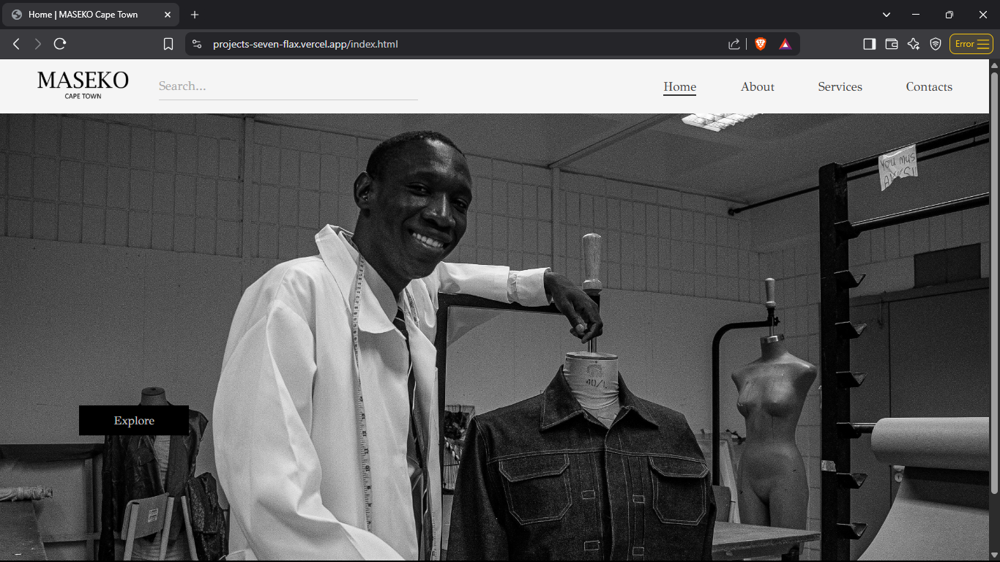
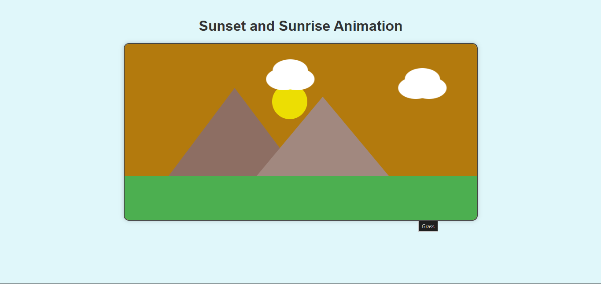
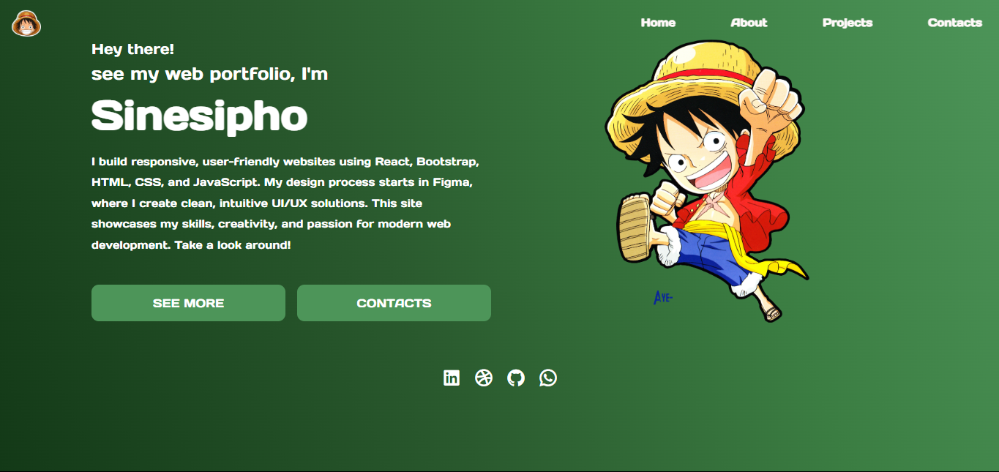

# 💼 Digital Portfolio – Work Readiness Training

Welcome to my digital portfolio for the Work Readiness Training program. I am currently a 3rd-year IT student at Cape Peninsula University of Technology (CPUT), specializing in web development and UI/UX design. This portfolio includes evidence and STAR reflections for career counselling, skills and interests, personality assessment, and my CV.

---

## 🔍 Career Counselling

### 📄 Evidence
On **15 May 2025**, I attended a career counselling session through CPUT’s Career Development Services. We discussed potential career paths in tech and how my web development skills align with roles like **front-end developer** and **UI/UX designer**.

### ✨ Reflection (STAR Technique)

**S**: I was unsure about the specific direction I wanted to take within web development.  
**T**: I needed professional guidance to define my career goals and action steps.  
**A**: I scheduled a session, completed a career interest assessment, and discussed my projects and strengths with the advisor.  
**R**: I gained clarity on my career goals and received tailored advice on building a strong portfolio and gaining real-world experience through internships.

---

## 🧠 Skills and Interests

### 📄 Evidence
I specialize in web technologies and design, including:

- HTML, CSS, JavaScript
- React & Bootstrap
- Responsive Web Design
- UI/UX tools like Figma
- SVG animation & design
- Digital branding & SEO

### ✨ Reflection (STAR Technique)

**S**: I was tasked with creating a professional portfolio website and interactive SVG animations.  
**T**: I needed to use my technical and creative skills to complete the assignments with high quality.  
**A**: I applied my knowledge of HTML, CSS, and JavaScript frameworks, and used UI/UX principles to guide my designs.  
**R**: My work received strong feedback for creativity, structure, and responsiveness, reinforcing my passion for front-end design and development.

---

## 🧬 Personality Assessment

### 📄 Evidence
I completed the **16Personalities** test and my result was **INFJ – Advocate**. This profile aligns with my strengths in thoughtful design, creativity, empathy, and working on meaningful, user-centered projects.

### ✨ Reflection (STAR Technique)

**S**: I was curious about how my personality affects my work habits and collaboration style.  
**T**: I wanted to understand how to use my natural strengths effectively in teams and projects.  
**A**: I completed a personality test and compared the results with my experiences in team-based assignments.  
**R**: The test confirmed that I am a reflective and purpose-driven person who thrives in creative, collaborative roles—perfect for front-end and UX design.

---

## 📃 CV Creation

### 📄 Evidence
I designed a professional CV using a clean layout that includes:

- Personal profile and contact info
- Education (CPUT – Web Development)
- Technical skills (React, JavaScript, UI/UX)
- Projects (React Portfolio, SVG Scene, Apply Point, Housing Campaign)
- Soft skills and extracurriculars
- References

📎 [Link to my CV (PDF)](CV.pdf)

### ✨ Reflection (STAR Technique)

**S**: I needed to prepare a professional CV to apply for internships and jobs.  
**T**: I had to ensure my CV accurately reflected my strengths and experience.  
**A**: I created a custom design, structured my content, and refined it with feedback from peers and mentors.  
**R**: I now have a ready-to-use CV that clearly communicates my value as a junior web developer and designer.

---

## 📤 CV Submission

### 📄 Evidence
I submitted my final CV to the work readiness coordinator on **22 May 2025** for evaluation and feedback as part of the program.

### ✨ Reflection (STAR Technique)

**S**: Submitting my CV was a key requirement for the work readiness program.  
**T**: I had to meet the deadline and show growth in my presentation and documentation skills.  
**A**: I submitted the final version of my CV after revisions, with special attention to layout and clarity.  
**R**: I received positive feedback and now feel confident in presenting myself to potential employers.

---

## 🖼️ Project Previews

### MASEKO CAPETOWN – A project for my first client

A sleek and practical website crafted for a designer/tailor to showcase custom garments and services. Built using HTML, CSS, and JavaScript, with a strong focus on clean design, accessibility, and smooth user interaction.

🌐 [View Live Website](https://projects-seven-flax.vercel.app/)

### Thematic Animated SVG Scene

An interactive landscape built using native SVG markup and CSS animations. Included custom gradients, paths, and animated elements to meet course requirements.

### My Web Portfolio – Built with React

This is my personal web development portfolio built using **React**, showcasing my skills, projects, and contact information.  
🌐 [View Live Portfolio](https://portfolio-eyemshams-projects.vercel.app)

Key features:
- Smooth routing with `React Router DOM`
- Clean responsive design using `Bootstrap`
- Modular component-based architecture
- Custom sections for About, Skills, and Contact

---

## ✅ Final Notes

This portfolio reflects my growth as a developer, designer, and young professional. Through this program, I’ve developed clarity, confidence, and real-world experience to support my career in the digital tech industry.

Thank you for reviewing my portfolio!
